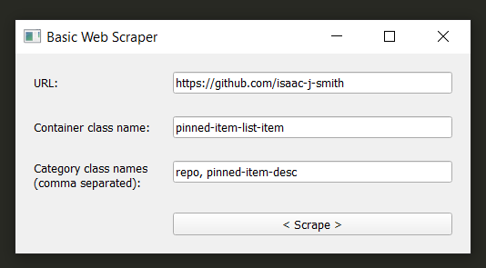

# Web-Scraper
This python script serves as a configurable web scraper that takes user input

It is a basic gui built using PyQT for the purpose of scraping static webpages. To use, run main.py

After, populate the url, container, and category fields. At this time, the container field only supports CSS class names. The category field must be comma seperated ( i.e. title, description, price ).

Once the data is scraped, a dialog with the output will be displayed.

